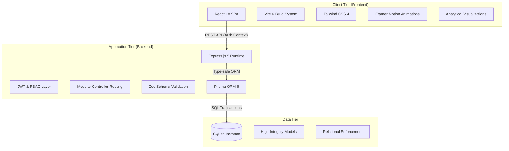

# System Architecture: FleetPro

FleetPro follows a high-performance 3-tier decoupling strategy designed for modularity, enterprise-grade scalability, and intuitive deployment.

## High-Level Architecture

## Core Modules

### 1. Presentation Tier (React SPA)
- **Vite 6**: Utilizing next-gen build optimization for sub-second hot module replacement.
- **Tailwind CSS 4**: A utility-first design system defining the "FleetPro" premium aesthetic.
- **Framer Motion**: Powering smooth transitions and interactive micro-animations across the dashboard.
- **Context-Driven State**: Global `AuthContext` manages session longevity and role-based component rendering.

### 2. Logic Tier (Express Server)
- **RBAC Middleware**: A dual-layer security model that verifies JWT authenticity and enforces role-specific route access (e.g., restricting `/api/users` to Admins).
- **Zod Validation**: Ensures strict data contract enforcement before processing business logic.
- **Unified API Client**: A robust frontend utility that handles token injection and direct JSON parsing for consistency.

### 3. Persistance Tier (Prisma + SQLite)
- **Schema-First Design**: Utilizing Prisma's type-safe client to ensure the frontend, backend, and database share a single source of truth.
- **Data Lifecycle**: Implements cascaded deletes for asset-history relationships and unique constraints for user security.

### 4. Specialized Workflow: User Management
The system includes a dedicated administrative sub-system for user lifecycle control. It features:
- **Load Monitoring**: Tracking `assignedTasks` count per operator in real-time.
- **Security Safeguards**: Route-level blocks on administrative self-deletion and self-role-demotion to prevent lockouts.
