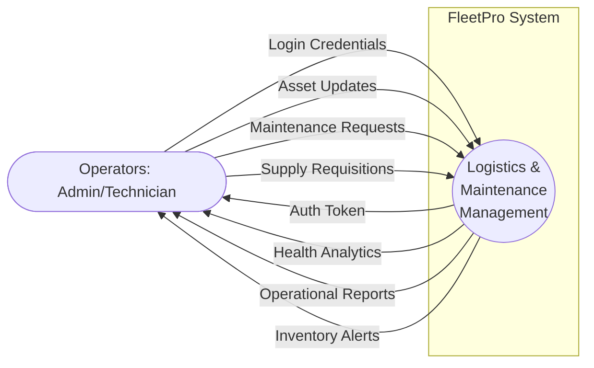
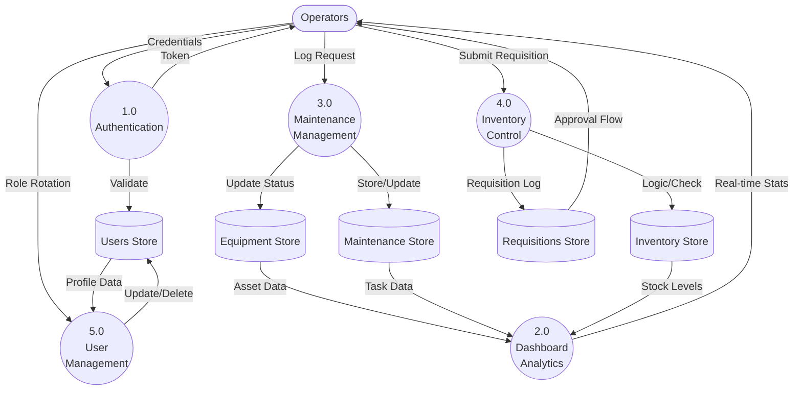

# Data Flow Diagrams (DFD)
## FleetPro: Logistics Maintenance Management System

This document illustrates the flow of data through the FleetPro system, from external entities to internal processes and data stores.

---

## Level 0: Context Diagram
The Context Diagram shows the system as a single process and its interaction with external entities (Users).

---

## Level 1: Functional Decomposition
The Level 1 DFD breaks down the main system into primary functional processes and shows data stores.

---

## Data Flow Descriptions

### 1.0 Authentication
- **Input**: User login credentials (email/pw).
- **Internal**: bcrypt comparison and JWT signing.
- **Output**: Bearer session token.

### 2.0 Dashboard Analytics
- **Input**: Raw counts from all data stores.
- **Logic**: Aggregation and threshold checking (e.g., quantity < minStock).
- **Output**: Multi-tab visual metrics (Fleet Health, Inventory).

### 3.0 Maintenance Management
- **Input**: Equipment IDs, priorities, and assigned technician IDs.
- **Logic**: State transition management (Pending -> In Progress -> Completed).
- **Update**: Modifies Equipment status to "Under Maintenance" during active tasks.

### 4.0 Inventory Control
- **Input**: Stock quantities and replenishment requisitions.
- **Output**: Automated alerts for items below critical thresholds.

### 5.0 User Management
- **Input**: Administrative commands to delete or promote users.
- **Safety**: Validates that no admin is attempting self-deletion.
