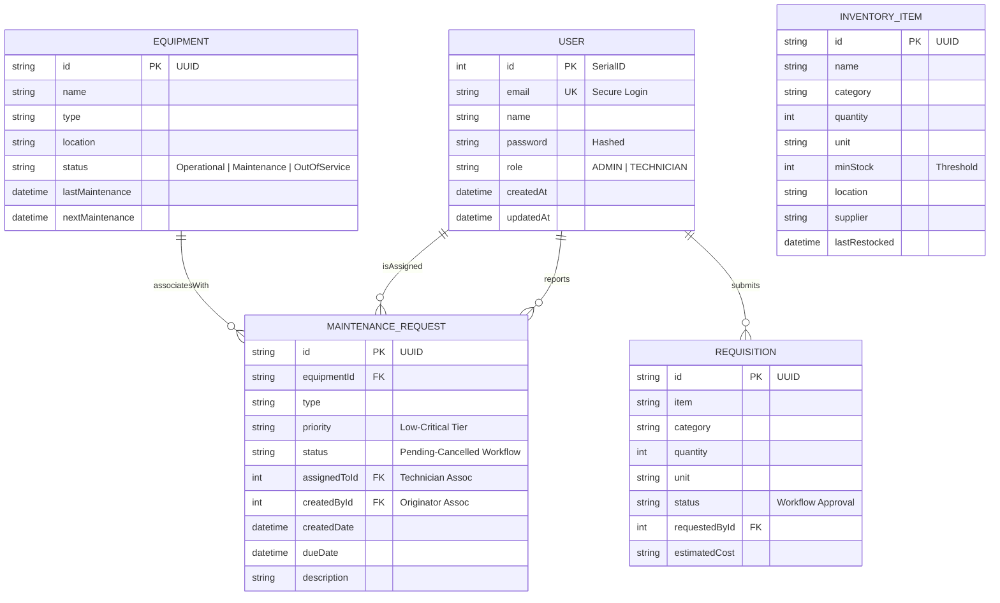

# Entity Relationship Diagram (ERD)
## for FleetPro: Logistics Maintenance Management System

This document details the database architecture of FleetPro. The system utilizes SQLite with Prisma ORM, implementing 5 primary models designed for high-integrity logistics operations.

## Database Schema Model

## Architectural Decoupling & Constraints

### 1. User Orchestration (RBAC)
- **Role Assignment**: Managed via the `role` enum. Access to `/api/users` is restricted to `ADMIN` tokens.
- **Relational Integrity**: Deleting a `USER` record requires checking for active `assignedTasks`. Admin deletion is restricted at the route level.

### 2. Asset Lifecycle (Equipment)
- **State Machine**: Equipment status updates automatically trigger dashboard health recalculations.
- **Cascading Logic**: Deleting `EQUIPMENT` cascades to its `MAINTENANCE_REQUEST` history to ensure data cleanliness.

### 3. Supply Chain (Inventory & Requisitions)
- **Threshold Alerts**: `quantity <= minStock` triggers the 'Low Stock' flag in the Dashboard Inventory tab.
- **Accountability**: `REQUISITION` records are hard-linked to `USER` for auditing purposes.

## Security & Performance
- **Indexing**: Frequent filters on `status`, `equipmentId`, and `email` are indexed for sub-100ms lookup.
- **Concurrency**: Prisma's transaction engine handles state transitions for approval workflows securely.
